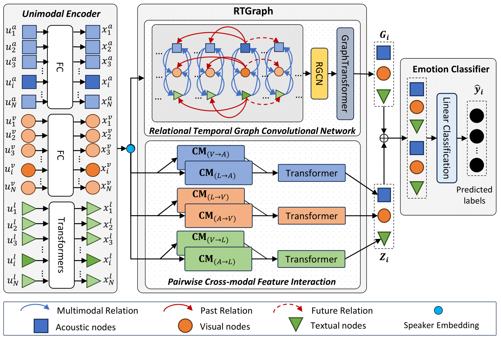

# CORECT

Abstract:

Emotion Recognition in Conversations (ERC) is a crucial research area for affective dialogue systems to understand and interpret users' emotions. It becomes more challenging with the multimodal nature of human communication, involving language, voice, and facial expressions. Most existing approaches take fused features of multiple modalities as input without leveraging specific modality representations.
Furthermore, the temporal aspect of dialogue is often neglected or only modeled by utilizing temporal information based on speakers or emotional shifts. Considering the utterance level, which naturally encompasses both the temporal factor and the aforementioned aspects, there is a need to fully exploit the temporal and modality-specific features. Therefore, we propose the Relational Temporal Graph Neural Network with Auxiliary Cross-Modality Interaction for Conversation Understanding (CORECT), an interpretable graph-based neural model that effectively captures the cross-modality interaction and temporal dependencies. CORECT achieves state-of-the-art results on the IEMOCAP and CMU-MOSEI datasets, demonstrating its effectiveness for the multimodal ERC task.

Architecture:

## Requirements
```
python==3.11.3
torch==2.0.1
torch-geometric==2.3.1
sentence-transformers==2.2.2
comet-ml==3.33.4
```
### Installation
- [PyTorch Geometric](https://pytorch-geometric.readthedocs.io/en/latest/notes/installation.html)
- [Comet.ml](https://www.comet.ml/docs/python-sdk/advanced/)
- [Sentence Transformer](https://www.sbert.net/)
## Running
The best result we achieved from 10 runs with the same hyperparameters, and log of the best result can be viewed here: [IEMOCAP6-BEST](./output/iemocap6_best), [IEMOCAP4-BEST](./output/iemocap4_best)
### Datasets
The dataset we obtained is from [COGMEN](https://github.com/Exploration-Lab/COGMEN)
### Preparing datasets
```
bash run_preprocess.sh
```
### Training
```
bash run_train.sh
```
### Evaluate
```
bash run_eval.sh
```
## Acknowledgments
The structure of code inspired by: [dialogue_gcn](https://github.com/mianzhang/dialogue_gcn)